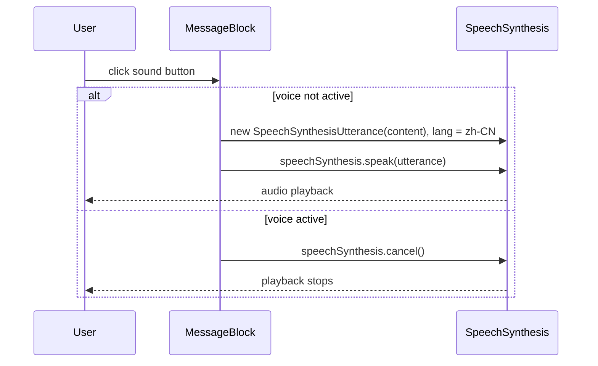

# Voice output (text-to-speech) for messages

## Goal

- Next to each reply in the conversation (user and assistant), show a small button with a sound/speaker icon.
- On click, read out the text of that reply.
- Use a **free** solution suitable for **Chinese** text-to-speech.

## Approach: Web Speech API

Use the **browser’s Web Speech API** ([SpeechSynthesis](https://developer.mozilla.org/en-US/docs/Web/API/SpeechSynthesis)):

- **Free**, no API key, no backend, no rate limits.
- **Chinese (Mandarin)** is supported via `SpeechSynthesisUtterance` with `lang: 'zh-CN'` (or `'zh'`). Support is good in Chrome, Safari, and Edge; Firefox can be inconsistent depending on OS/voices.
- Implementation: create a `SpeechSynthesisUtterance` with the message `content`, set `lang` to `'zh-CN'` for both user and assistant messages (conversation is Chinese-focused), then call `window.speechSynthesis.speak(utterance)`.
- **Cancel on second click:** when the user clicks the sound button while speech is active (for that message or any message), call `speechSynthesis.cancel()` to stop playback. So: first click = speak; click again while speaking = cancel.

No new API routes or environment variables are required.

---

## Implementation (Web Speech API)

### 1. Sound icon and button

- Reuse an existing icon if the project already has an icon set (e.g. Heroicons, Lucide), or add a simple inline SVG **speaker/sound** icon (e.g. speaker with sound waves).
- Place the icon inside a small `<button type="button">` next to the message bubble so it’s clear it’s “play TTS for this message”.

### 2. MessageBlock: add the TTS button

**File:** [components/MessageBlock.tsx](components/MessageBlock.tsx)

- Keep the current layout: a flex row for the message (user right, assistant left).
- Add a **sound button** in the same row as the bubble (e.g. after the bubble, or before it for assistant so it doesn’t sit too far right). Use `items-start` or `items-center` so the button aligns nicely with the bubble.
- Button behavior: `onClick` toggles speak/cancel:
  - If `speechSynthesis.speaking` is true (voice is active), call `speechSynthesis.cancel()` to stop.
  - Otherwise: create `new SpeechSynthesisUtterance(content)`, set `lang` to `'zh-CN'`, and call `speechSynthesis.speak(utterance)`.
  - Guard with `typeof window !== 'undefined'` when using `window.speechSynthesis`.
- Optional: try to select a Chinese voice with `speechSynthesis.getVoices()` and `utterance.voice = ...` when available; fall back to default voice otherwise.
- Optional: visually indicate “playing” state (e.g. different icon or disabled state while `speechSynthesis.speaking`) so the user sees that another click will cancel.

No new props are strictly required: the component already receives `content`, which is the text to speak.

### 3. Optional: shared TTS hook or util

- Either implement the speak logic **inline** in MessageBlock or extract it to a small util/hook (e.g. `useSpeechSynthesis()` or `speakText(text: string, lang?: string)`) in a shared module so it can be reused elsewhere (e.g. word lookup, future features).
- If you prefer to keep the first iteration minimal, inline in MessageBlock is fine.

### 4. Accessibility and UX

- Give the button an accessible label (e.g. `aria-label="Read aloud"` or “Play message”).
- Ensure the button is keyboard-focusable and not disabled without reason.

---

## Data flow (Web Speech API)

---

## Files to change

| File                                                       | Change                                                                                                                              |
| ---------------------------------------------------------- | ----------------------------------------------------------------------------------------------------------------------------------- |
| [components/MessageBlock.tsx](components/MessageBlock.tsx) | Add a sound icon button next to the message bubble; on click speak (Web Speech API, `lang: 'zh-CN'`) or cancel if already speaking. |

No new API routes, no new environment variables, and no changes to ChatView or message data structures.