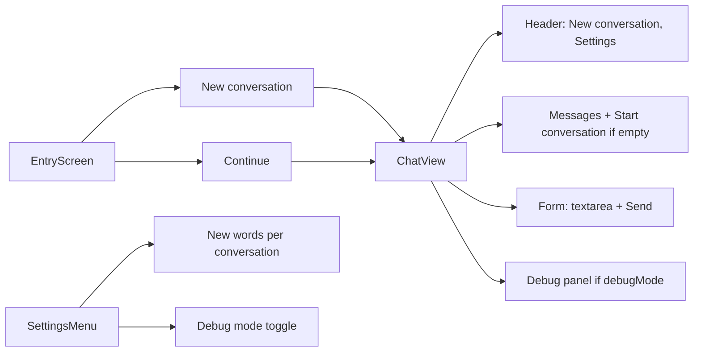

# UI flow

## Components

- **Entry:** [components/EntryScreen.tsx](../components/EntryScreen.tsx) — optional topic (English), “New conversation” / “Continue”.
- **Chat:** [components/ChatView.tsx](../components/ChatView.tsx) — message list (unique ids via `crypto.randomUUID()` for user messages), clickable words on assistant messages (word lookup + usage recording), “Start conversation” when empty; when **Debug mode** is on, a bottom panel shows raw LLM traffic (POST /api/chat request body and response JSON, last 20 entries).
- **Settings:** [components/SettingsMenu.tsx](../components/SettingsMenu.tsx) — “New words per conversation” (1–50, localStorage key `chinese-vocab-newWordsPerConversation`), “Debug mode (show LLM traffic)” (localStorage key `chinese-vocab-debugMode`).
- **Layout:** [app/layout.tsx](../app/layout.tsx) — viewport via `export const viewport` (not in metadata). Main chat layout capped at 85vh; chat area flex-1 min-h-0.
