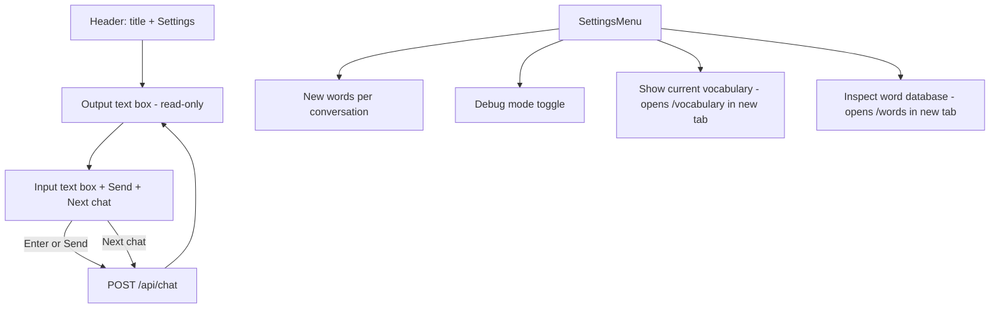

# UI flow

Single screen only (no entry vs chat switch). Same layout on first load and after.

## Components

- **Main page:** [app/page.tsx](../app/page.tsx) — single layout: header (title + Settings) and ChatView. No EntryScreen; settings closed by default.
- **Chat:** [components/ChatView.tsx](../components/ChatView.tsx) — output area (message list, clickable words, word lookup), input textarea (Enter sends, Shift+Enter newline), Send button, **Next chat** button (starts new conversation with current input as first message). User messages use unique ids (e.g. `crypto.randomUUID()`). When **Debug mode** is on, a bottom panel shows raw LLM traffic (POST /api/chat, last 20 entries).
- **Settings:** [components/SettingsMenu.tsx](../components/SettingsMenu.tsx) — "New words per conversation" (1–50, localStorage), "Debug mode (show LLM traffic)" (localStorage), **"Show current vocabulary"** link (opens /vocabulary in new tab), **"Inspect word database"** link (opens /words in new tab).
- **Vocabulary page:** [app/vocabulary/page.tsx](../app/vocabulary/page.tsx) — reads `newWordsPerConversation` and `debug` from URL; fetches GET /api/vocabulary. If debug off: shows words comma-separated (+ title and count). If debug on: shows one row per word with full DB info (word, frequency, pinyin, english_translation, usage history).
- **Words page:** [app/words/page.tsx](../app/words/page.tsx) — full word database sorted by spaced repetition score. Fetches GET /api/words with limit, offset, search. Table: score, word, frequency, pinyin, english_translation; search box; Previous/Next pagination; optional "View usage" per row (GET /api/words?word=X).
- **Layout:** [app/layout.tsx](../app/layout.tsx) — viewport via `export const viewport`. Main chat layout capped at 85vh; chat area flex-1 min-h-0.
